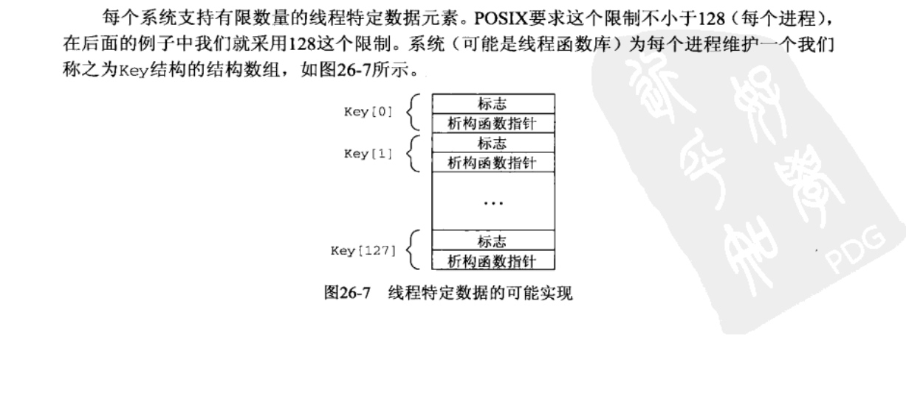
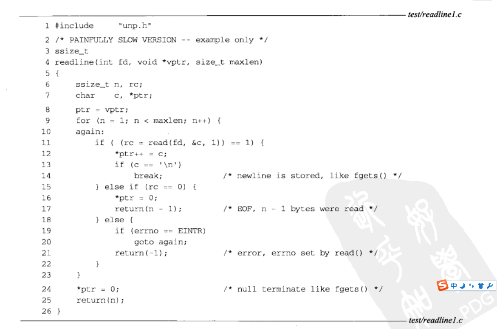
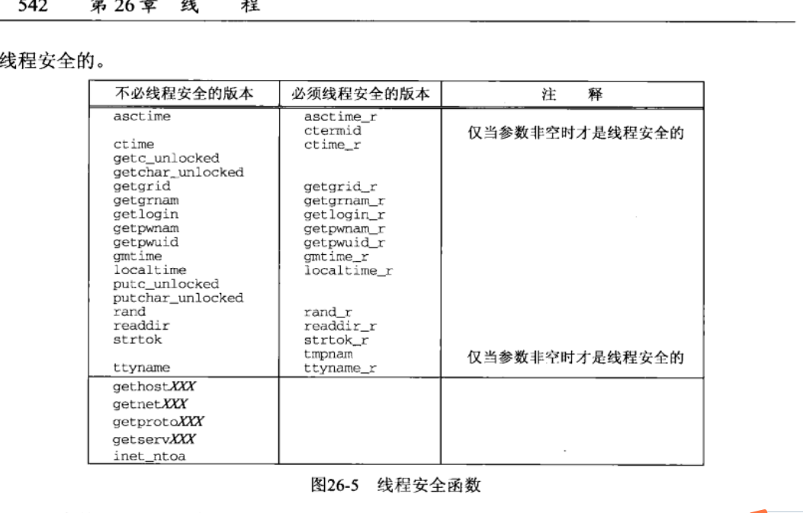
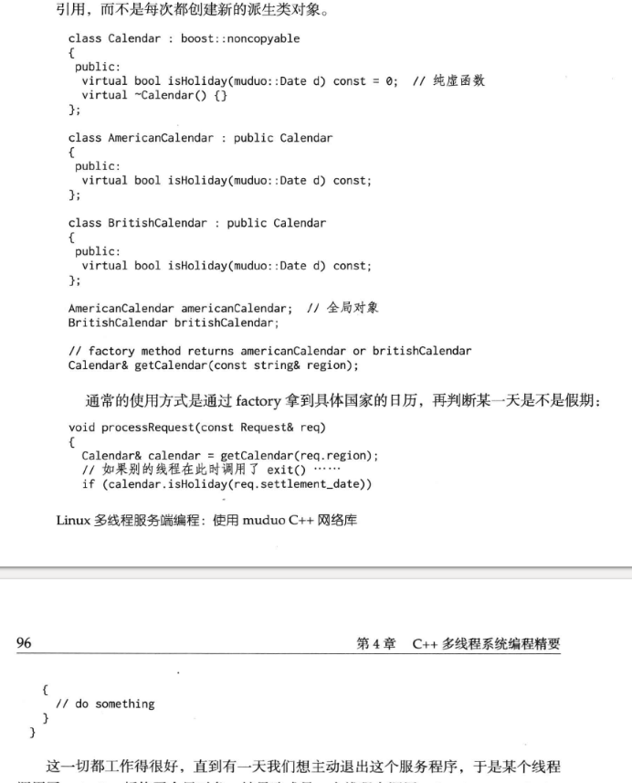
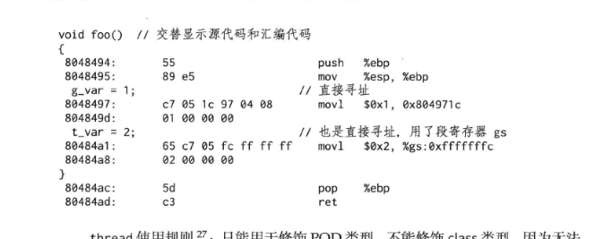
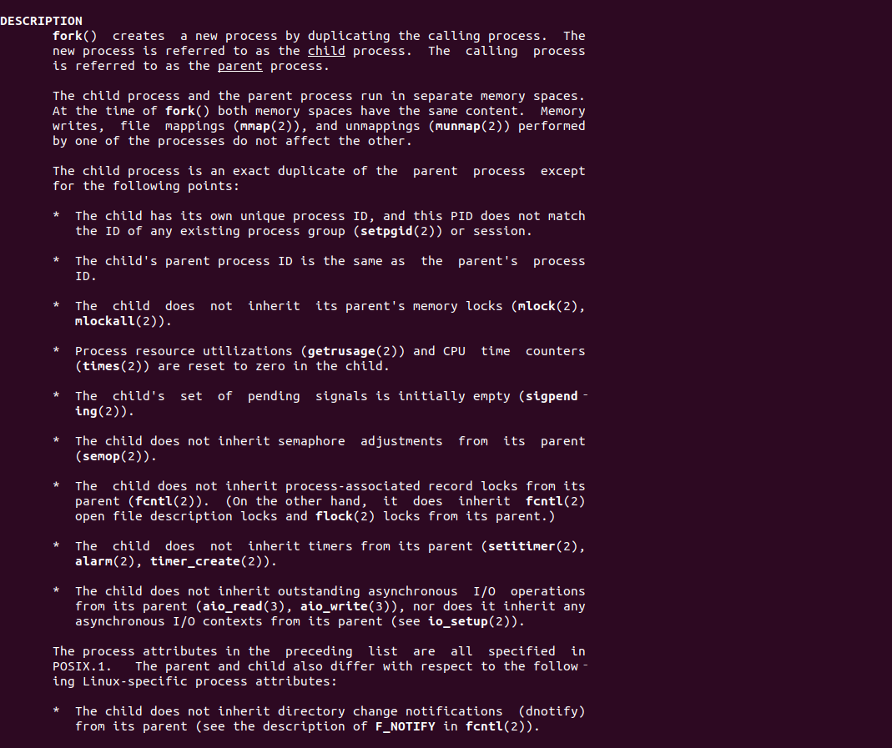

#c++多线程系统编程精要

学习多线程系统编程要面临两个思维转变：

1.当前线程可能会被随时切换出去

2.多线程中事件发生顺序不会再有全局的先后关系

当线程被切换回来继续执行下一条语句的时候,全局数据可能已经被其他线程修改。例如在没有为指针p加锁的情况下，if(p && p->next){/**/}就有可能会
导致segfault,因为在逻辑与的前一个分支评估为true的那一刹那,p可能被其他线程设置为NULL或者被释放，后一个分支就访问了一个非法地址

在单cpu系统中，理论上我们可通过cpu执行的指令先后顺序来推演多线程的实际交织运行情况。在多核系统中，多个线程是并行执行的，我们甚至没有一个全局
时钟来为每个事件编号。在没有适当同步的情况下，多个cpu上运行的多个线程中的事件发生顺序是无法预测的，在引入了适当的同步之后，事件才会有先后

多线程的正确性不依赖于任何线程的执行速度，不能通过原地等待sleep来确定他的事件已经发生，而必须要通过适当的同步来让当前线程能看到其他线程的执
行结果。无论线程执行的快与慢，程序都应该能正常执行。

看到书中的这个例子我想到了我之前logSentry让线程终止其实也暗藏风险，好在没有跨现场使用这种函数

下面看一下这个demo和例子

```
bool running = false;

void threadFunc()
{
    while(running)
    {
        //get task from queue
    }
}

void start()
{
    muduo::thread t(threadFunc);
    t.start();
    running = true;
}
```

这段代码在系统负载高的时候，running会被推迟赋值，导致系统直接退出，正确做法是把running 放在pthread_create的前面

####4.1基本的线程原语

POSIX threads 的函数有110多个，真正常用的也就10几个

11个基本的函数分别是：

2个：线程的创建和等待结束。
4个：mutex的创建 销毁 加锁 解锁
5个：条件变量的创建 销毁 等待 通知 广播

用thread mutex 和 condition 可以轻松完成多线程任务。

一些函数可以酌情使用:

1.pthread_once 封装muduo::Singleton<T>。其实不如直接使用全局变量。

2.pthread_key* 封装为muduo::ThreadLocal<T>。可以考虑用__thread替换之。

读到这里我就思考pthread_key是什么？我记得这个在<<unix>>网络编程里有过记载，在这里在回忆一下数据pthread_key_create,再次回头看一下unix
网络编程26章26.5线程特定数据

我们在把一个不可重入带有静态变量的函数带入多线程当中是十分危险的，这个静态变量无法保存各个线程的值。

使用线程特定数据。这个办法并不简单，有点事不需要变动程序调用顺序只是需要更改函数中的代码即可。

使用线程特定数据是让现有函数变成线程安全函数的有效办法

不同系统要求支持有限个线程特定数据。posix要求这个限制不小于128个。

pthread_create_key为我们创建一个不再使用的线程特定数据的key

除了key之外还提供了一个析构函数指针。



我们首先看一下旧版程序当中的readline



说实话我没有找到这个函数在多线程编程中有什么问题，因为我认为并没有使用任何全局变量和任何静态变量，不会出现可重入问题，我们在看一下书中的demo
，然后自己手写一下看看书中的代码是有什么作用的,这段代码是我在我ubuntu电脑上摘抄的。
```
#include <vector>
#include <string>
#include <assert.h>
#include <iostream>
#include <zconf.h>
#include <fcntl.h>

static pthread_key_t r1_key;
static pthread_once_t r1_once = PTHREAD_ONCE_INIT;
#define MAXLINE 1024

typedef struct{
    int r1_cnt;
    char *r1_bufptr;
    char r1_buf[MAXLINE];
}Rline;

static void readline_destructor(void* ptr)
{
    free(ptr);
}

static void readline_once(void)
{
    pthread_key_create(&r1_key,readline_destructor);
}

static ssize_t my_read(Rline *tsd,int fd,char* ptr)
{
    if(tsd->r1_cnt <= 0)
    {
        again:
        if((tsd->r1_cnt = read(fd,tsd->r1_buf,MAXLINE)) < 0)
        {
            if(errno == EINTR)
            {
                goto again;
            }
            return (-1);
        }else if(tsd->r1_cnt == 0)
        {
            return 0;
        }
        tsd->r1_bufptr = tsd->r1_buf;
    }

    tsd->r1_cnt--;
    *ptr = *tsd->r1_bufptr++;
    return(1);
}

size_t readline(int fd,void *vptr,size_t maxlen)
{
    ssize_t n,rc;

    char c, *ptr;

    void *tsd;

    pthread_once(&r1_once,readline_once);

    if((tsd = pthread_getspecific(r1_key)) == nullptr)
    {
        tsd = calloc(1,sizeof(Rline));
        pthread_setspecific(r1_key,tsd);
    }

    ptr = (char*)vptr;

    for(n=1;n<maxlen;n++)
    {
        if((rc = my_read((Rline*)tsd, fd, &c)) == 1)
        {
            *ptr++ = c;

            if(c == '\n')
            {
                break;
            }
        }else if(rc == 0)
        {
            *ptr = 0;
            return (n-1);
        }else{
            return -1;
        }
    }

    *ptr = 0;
    return n;
}
int main()
{
    int fd = open("/home/zhanglei/ourc/test/demoParser.y",O_RDWR);
    if(fd <0)
    {
        return -1;
    }
    char buf[BUFSIZ];
    int res = readline(fd,buf,BUFSIZ);
    if(res <0)
    {
        return -1;
    }
    printf("%d\n",res);
    printf("%s\n",buf);
}
```

析构函数：

我们的析构函数仅仅释放造诣分配的内存区域

一次性函数：

我们的一次性函数将由pthread_once调用一次，他只是创建由readline使用的健

Rline结构含有因在图3-18中声明为static而导致前述问题的三个变量。调用readline的每个线程都由readline动态分配一个Rline的结构，然后由析构函数
释放。

my_read函数

本函数第一个参数现在是指向预先问本线程分配的Rline结构的一个指针。

分配线程特定的数据

我们首先调用pthread_once,使得本进程的第一个调用readlink的线程通过调用pthread_once创建线程的特定健值

获取特定的数据指针

pthread_getspecific返回指向特定与本线程的Rline结构指针。然而如果这次是本线程首次调用readline，其返回一个空指针。在这种情况下，我们分配一个
Rline结构的空间，并且有calloc将r1_cnt成员初始化为0.然后我们调用pthread_setspecific为本线程存储这个指针。下一次调用readline的时候，
pthread_getspecific将返回这个刚刚存储的指针。

总结
读到这里已经了解到基本用法了，pthread_once初始化线程特定的key，然后根据特定key获取线程特定数据，没有的话重新设置

我们在看下muduo中的代码，如何把线程特定数据应用到实践当中 

说一些注意点，从上面的代码我们了解到在一些版本中，我们的一个进程最多只拥有有限量的特定数据，比如一些posix只有128个，书中的ThreadLocal设计
的很简单，看一下代码的实现

```
namespace muduo
{

template<typename T>
class ThreadLocal : noncopyable
{
 public:
  ThreadLocal()
  {
    MCHECK(pthread_key_create(&pkey_, &ThreadLocal::destructor));
  }

  ~ThreadLocal()
  {
    MCHECK(pthread_key_delete(pkey_));
  }

  T& value()
  {
    T* perThreadValue = static_cast<T*>(pthread_getspecific(pkey_));
    if (!perThreadValue)
    {
      T* newObj = new T();
      MCHECK(pthread_setspecific(pkey_, newObj));
      perThreadValue = newObj;
    }
    return *perThreadValue;
  }

 private:

  static void destructor(void *x)
  {
    T* obj = static_cast<T*>(x);
    typedef char T_must_be_complete_type[sizeof(T) == 0 ? -1 : 1];
    T_must_be_complete_type dummy; (void) dummy;
    delete obj;
  }

 private:
  pthread_key_t pkey_;
};

}  // namespace muduo
```

构造函数中,调用pthread_create_key创建了key以及绑定了析构函数,在析构函数中用来销毁key，调用的是pthread_key_delete，
value函数用来获取值，destructor用来释放内存

不建议使用的是：

pthread_rwlock,读写锁使用起来要谨慎

sem_* 信号量系列

pthread_cancel 和 pthread_kill 出现他们意味着程序设计出现了问题 

我非常推荐这个说法，因为在<<unix网络编程第二卷>>中对各个锁的性能是有比较的，在对一个内存相加的情况下，互斥锁效率是最高的。
c++多线程编程的难点在于理解库函数和系统调用的关系  

####4.2 c\c++的安全性

多线程的出现给传统的编程带来了冲击，例如:

1.errno不再是一个全局变量,因为不同的线程可能执行不同的系统库函数

2.有些纯函数是不受影响的，比如malloc\free、printf和fread、fseek等等。

3.有些使用静态变量的函数不可能不受到影响，可以使用例如asctime_r,ctime_r,gmtime_r和stderror_r还有stock_r

4.传统的fork模型不再适合多线程

我们看一下unix网络编程第二卷中的规定的glibc系统函数，简单的了解一下书中记载的部分函数



####4.3 linux上的线程标识

POSIX上提供了pthread_self函数用于返回当前的进程标识符，其类型为pthread_t。pthread_t不一定是一个数值类型，也有可能是一个结构体，因此
pthreads专门提供了pthread_equal函数用于对比两个线程标识符是否相等

但是这会带来一些问题，包括:

1.无法打印pthread_t,因为不知道确切的类型。也就没法表示他的线程id

2.无法比较pthread_t 的大小或计算他的值，因此无法用做关联容器的key

3.无法定义一个非法的pthread_t 用来表示线程不存在

4.pthread_t 在进程内有意义，与操作系统的调度无法建立有效的关联。

另外glibc的pthreads实际上把pthread_t作为一个结构体指针，而且这个内存块是很容易被复用

所以说pthread_t不适合作为线程标识符

在linux上建议使用gettid系统调用作为线程的id

1.返回的类型是pid_t 便于在日志中输出

2.在现代系统中，他表示具体的内核调度的任务id，因此可以很轻松的在/proc/tid或者/proc/pid/task/tid下面找到

3.任何时刻都是全局唯一的，并且由于linux分配新的pid采用递增轮回的办法，短时间内启动多个线程也会觉有不同的线程id

4.0是非法值，因为操作系统第一个进程init 的 pid是唯一的,当然ubuntu的跟系统是systemd

glibc并没有提供这个函数，我们要自己写，我们看一下muduo是如何实现的
核心代码
```
#include <sys/syscall.h>
::syscall(SYS_gettid)
```

当然muduo为了提升效率是做了缓存的

####4.4线程的创建和销毁

线程的创建和销毁是基本要素，线程的创建要比销毁容易的多，只需要遵循下面的几个原则：

1.程序库不应该在未提前告知的情况下创建自己的背景线程

2.尽量用相同的方式创建线程

3.进入main函数之前不应该启动线程

4.程序中线程的创建最好能在初始化阶段全部完成。

以下分别谈一下这几个观点：

一个进程可以创建的并发线程数目受限于地址空间的大小和内核的参数，一台机器可以并行的线程数目受制于cpu的数目。因此我们在设计线程数目的时候要精心
设计，特别是根据cpu数目来设置线程数目，并且为关键任务留足够的计算机资源。

另一个原因是如果一个线程中拥有不止一个线程就很难保证fork不出问题

所以我写程序的时候也是这样的 fork 之前不会调用pthread_create去创建线程

理想情况下程序的线程都是用同一个class 来创建的，这样容易在程序的启动和销毁阶段做一些统一的簿记工作。比如说调用muduo::CurrentThread::tid()
把线程id缓存起来，以后在获取线程id就不会陷入到内核中去了。也可以统计当前进程有多少个线程在活动，一共创建了多少个线程，每个线程的用途是什么。
我们可以通过类来给线程命名，也可以用单例建立threadManager来管理当前活动的线程方便调试。

但是这不总是能做到，第三方库会启动自己的野生线程，因此他必须要每次都检查自己的线程id是否有效，而不能假设已经缓存了线程id直接返回就好了。如果
库提供了异步回调，一定要说明哪些线程调用了用户提供的异步回调函数这样用户就知道能不能执行耗时操作了，会不会阻塞其他的任务执行。

在main函数之前不要启动线程，因为这会影响全局对象的安全构造，我们知道c++在进入main函数之前已经完成全局初始化构造。同时各个编译对象之间的构造
顺序是不确定的。无论如何这些全局对象的构造是有序的，都是依次在主函数中完成，并不考虑线程安全问题。但是如果一个全局对象使用了线程，那就危险了
，因为这破坏了全局对象的初始化假设，万一一个线程访问了未经初始化的全局变量，这种隐晦的错误查起来很费劲。如果一个库要创建线程，那么要在进入main
函数之后去做这件事

线程的创建数目与cpu有关，不要为了一个链接去创建线程，线程的创建工作最好在初始化阶段，这样代价比频繁创建和销毁线程的代价小大约10分之1


线程的销毁有集中方式：

1.自然死亡 从线程主函数返回，线程正常退出

2.非正常死亡 主函数抛出异常，或者触发segfault信号

3.自杀 pthread_exit

4.他杀 调用pthread_cancel来强制终止线程

线程正常终止的做法只有一个就是自然死亡，任何从外部终止和结束的想法都是错的，pthread_cancel是线程没有机会清理资源。也没有机会释放一个已经持
有的锁。

如果确实要考虑终止一个io耗时很长的任务，而又不想周期性的检查某个全局变量，可以考虑把一部分代码fork到新的进程，kill（2）一个进程比杀死本进程
中的线程要安全的多，fork的进程与本进程的通讯可以考虑 pipe或者socketpair 或者 tcp 

书中有一个重要的原则就是对象的生命周期一般要长于线程的生命周期。

总结 ：
```
这一段内容说的是尽量不要从外部杀死线程，最好做到线程的自然死亡，线程的创建要在main之后，还有的时候我们要考虑第三方库的野生线程造成的安全问题。
一个重要的原则就是线程的生命周期必须要短于线程的生命周期。
```


######4.4.2 exit(3)不是线程安全的

exit(3)函数在c++中的作用除了终止,还会析构全局对象和已经构造完成的函数静态对象。这又潜在的死锁的可能性，考虑下面的例子

```
#include <vector>
#include <string>
#include <assert.h>
#include <iostream>
#include <zconf.h>
#include <fcntl.h>
#include <syscall.h>

class noncopyable{
protected:
    noncopyable() = default;
    ~noncopyable() = default;

private:
    noncopyable(const noncopyable&) = delete;
    const noncopyable& operator=( const noncopyable& ) = delete;
};


class MutexLock :public noncopyable{
public:
    MutexLock()
    {
        pthread_mutexattr_init(&mutexattr);
        pthread_mutex_init(&mutex, nullptr);
    }

    MutexLock(int type)
    {
        int res;
        pthread_mutexattr_init(&mutexattr);
        res = pthread_mutexattr_settype(&mutexattr,type);
        pthread_mutex_init(&mutex, &mutexattr);
    }

    ~MutexLock()
    {
        pthread_mutex_destroy(&mutex);
    }

    int lock()
    {
        int res = pthread_mutex_lock(&mutex);
        return res;
    }

    void unLock()
    {
        pthread_mutexattr_destroy(&mutexattr);
        pthread_mutex_unlock(&mutex);
    }

    pthread_mutex_t* getMutex()
    {
        return &mutex;
    }
private:
    pthread_mutex_t mutex;
    pthread_mutexattr_t mutexattr;
};

class MutexLockGuard
{
public:
    MutexLockGuard(MutexLock & mutex)
            : _mutex(mutex)
    {
        _mutex.lock();
    }

    ~MutexLockGuard()
    {
        _mutex.unLock();
    }

private:
    MutexLock & _mutex;
};

void someFunctionMayCallExit()
{
    exit(1);
}

class GlobalObject
{
public:
    void doit()
    {
        MutexLockGuard lock(mutex_);
        someFunctionMayCallExit();
    }

    ~GlobalObject()
    {
        printf("GlobalObject:~GlobalObject\n");
        MutexLockGuard lock(mutex_);
        printf("GlobalObject:~GlobalObject cleaning\n");
    }

private:
    MutexLock mutex_;
};

GlobalObject g_obj;

int main()
{
    g_obj.doit();
}
```

这个例子是非常有意思的一个程序，我们使用这个程序发生了死锁，命名exit之后在我的认知里程序应该正常退出了，但是它并没有，而是死锁了！

我们在这里思考，为什么会死锁呢？

doit中辗转调用了exit之后，从而触发了全局析构函数~GlobalObject(),他试图对mutex加锁，然而此时mutex被锁住了，于是造成了死锁。

我们再举一个调用纯虚函数导致程序崩溃的例子，假如有一个策略基类，在运行时候我们会根据情况使用不同的无状态策略。由于策略是无状态的，因此可以共
享派生类对象，不必每次都去新建。这里以日历基类和不同国家的假期为例子，factory函数返回某个全局对象的引用，而不是每次都创建新的派生类对象。



上面的程序当我们在exit时候，析构了全局对象，当我们另一个线程在调用isHoliday的时候会挂掉。

如果一个线程调用了exit，析构了全局对象Date，另一个线程调用isHoliday的时候会出现core dump

可见对现场当中exit不是意见容易的事情，我们需要精心设计析构函数的顺序，防止各个线程访问导致对象失效的问题。

####4.5善用__thread关键字

__thread是gcc内部的存储设施，比pthread_key_t要快。__thread的存储效率可以和全局变量相比较

```

int g_var;
__thread int t_var;

void foo()
{
    g_var = 1;
    t_var = 2;
}

```

书中展示了汇编的截图，我们只要看其中的两个mov1就可以。



发现效率确实是比较高的，跟操作全局变量一样，只有两个mov1，前面的push pop这些都是操作函数栈的不需要关心。

__thread 是不能用来修饰class类型的，只能用来修饰POD对象，书中的POD对象指的是

我从网上

```
POD全称Plain Old Data。通俗的讲，一个类或结构体通过二进制拷贝后还能保持其数据不变，那么它就是一个POD类型。

标准布局的定义
1.所有非静态成员有相同的访问权限

2.继承树中最多只能有一个类有非静态数据成员

3.子类的第一个非静态成员不可以是基类类型

4.没有虚函数

5.没有虚基类

6.所有非静态成员都符合标准布局类型


```

无法调用class的一个重要原因是因为他无法调用构造函数

```
#include <pthread.h>
#include <cstdio>
#include <cstdlib>
#include <assert.h>
#include <stdint.h>

class A{
public:
    int b;
    A(int data)
    {
        a = data;
    }
private:
    int a;
};

__thread class A a = 3;
int main(int argc, char const *argv[])
{
    a.b = 2;
    return 0;
}

```

下面写一个demo看一下，__thread修饰的变量是否在各个线程里有一个独立的实体

```
#include <pthread.h>
#include <cstdio>
#include <cstdlib>
#include <assert.h>
#include <stdint.h>
#include <unistd.h>

__thread uint64_t pkey = 0;

void* run2( void* arg )
{
    pkey = 8;
    printf("run2-ptr:%p\n",&pkey);
    printf("run2:%ld\n",pkey);
    return NULL;
}

void* run1( void* arg )
{
    printf("run1-ptr:%p\n",&pkey);
    printf("run1:%ld\n",pkey);

    return NULL;
}

int main(int argc, char const *argv[])
{
    pthread_t threads[2];
    pthread_create( &threads[1], NULL, run2, NULL );
    sleep(1);
    pthread_create( &threads[0], NULL, run1, NULL );
    pthread_join( threads[0], NULL );
    pthread_join( threads[1], NULL );
    return 0;
}

```

到这里我们看到由于加上了__thread 本来第二个线程用该输出8 结果变成了0，并没有根据第一个线程的变化而变化

####4.6 多线程和IO

文中说操作文件的io是线程安全的，这个我不是很确定，我一直是用pread和pwrite去处理文件io的，我之前写过demo，做过实验，多个线程操作同一个socket
确实是需要上锁的，如果不上锁会出现问题的

```
git@github.com:LeiZhang-Hunter/sendDemo.git
```

其实这个问题本身意义不大，read和write都是原子的，那么我们多线程读写一个文件的内容，如果要操作，那么很容易出问题，在不上锁的情况下，静态条件
难以避免，时序问题也是一个问题，所以我认为每个描述符尽量只由一个线程去操作。


####4.7用RAII去封装描述符

程序刚启动的时候大家都知道的三个描述符 

0 1 2 标准输入 标准输出 标准错误输出，posix标准规定每次打开文件的时候描述符必须是当前最小的号码，其实多线程对于描述符的接口就像我们写fpm接
口一样，多线程频繁的read close同一个描述符必然会出现问题，就像我们一个点赞接口频繁的 点赞 取消点赞 如果不加锁，那么这个接口将会是非常危险的
，很容易被人刷赞，更糟糕的情况下，频繁取消点赞都可能变为负数，这真的是非常糟糕，多线程close 和 read 将会导致描述符串号这一点就不用多说了，
一个线程已经在read，另一个线程close掉了，将会发生很多危险的事情

c++里采取RAII手法去做这件事，用socket对象去包装描述符，把关闭放到析构里面去处理。只要socket还活着，就不会有其他socket对象跟他一样的描述符。
当然在这里的对象不要采取 new 这种形式非常危险，可以采用只能指针这将是非常安全的。

我十分赞同书中的思想，尽量少用delete new，尽量采用智能指针。


####4.8 RAII与fork

在编写c c++ 的时候，我们总是保证对象的构造和析构函数总是成对出现的，否则一定会有内存泄露，但是加入我们使用fork，将会很糟糕，会破坏这一个假设。

因为fork之后，子进程会继承地址空间和空间描述符，因此用于管理动态内存和文件描述符的RAII class 都能正常工作。但是子进程不能继承。

比如说：

1.父进程的内存所，mlock、mlockall

2.父进程的文件锁 fcntl(2)

3.父进程的某些定时器 settimer  alarm  timer_create

4.看一下man的介绍 man 2 fork 可以直接查看



具体不会继承的内容 分别是

1）进程id

2）内存锁

3）未决信号集

4）信号量

5）文件锁 

6）timer系列函数

7）父进程未完成的io

####4.9 多线程和fork
书中介绍了fork一般只会克隆控制线程 其他的线程都是会消失的，也就是说不能fork出一个同样多线程的子进程，稍后会写一个demo看一下，fork之后只会有
一个线程其他的线程都会小时，这会造成一个十分危险的局面。其他线程正好处在临界区内，持有了某个锁，而他突然死亡，再也没有机会去解锁了。如果子进程
试图对mutex加锁，会立刻造成死锁。

```
也就是说，如果主线程内有一个公共的锁，被其他线程持有了，这时候你fork之后只会保留控制线程，其他的线程占有了锁，你fork之后其他线程都没了，那
这个锁一旦被使用，那真的是灾难性的了，会造成死锁。
```

也就是说这个时候调用一系列函数可能是危险的：

1.malloc，malloc访问全局变量几乎都会有锁（这个我不是很清楚，毕竟没看过malloc部分的源码）

2.new、map::insert、snprintf......

3.不能使用pthread_signal去通知父进程，只能通过pipe

4.printf系列函数

5.man7中定义的 signal可重入以外的任何函数

到这我自己写了一个例子：

```
#include <pthread.h>
#include <cstdio>
#include <cstdlib>
#include <assert.h>
#include <stdint.h>
#include <unistd.h>

__thread uint64_t pkey = 0;

void* run2( void* arg )
{
    while(1)
    {
        printf("%d\n",getpid());
        sleep(2);
    }
    return NULL;
}

void* run1( void* arg )
{

    while(1)
    {
        printf("%d\n",getpid());
        sleep(2);
    }
    return NULL;
}

int main(int argc, char const *argv[])
{
    printf("parent:%d\n",getpid());
    pthread_t threads[2];
    pthread_create( &threads[1], NULL, run2, NULL );
    sleep(1);
    pthread_create( &threads[0], NULL, run1, NULL );
    pid_t pid = fork();
    if(pid > 0)
    {
        pthread_join( threads[0], NULL );
        pthread_join( threads[1], NULL );
    }else{
        printf("son:%d\n",getpid());
        while (1)
        {
            sleep(2);
        }
    }

    return 0;
}

```

运行结果

```
parent:31424
31424
31424
son:31436
31424
31424
31424
31424
31424
31424
```

印证了书中的说法，只有父辈的线程在运行，子线程没有运行

####4.10 多线程与signal

尽量不要在多线程中用signal

